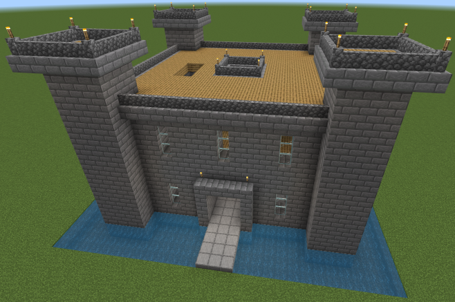
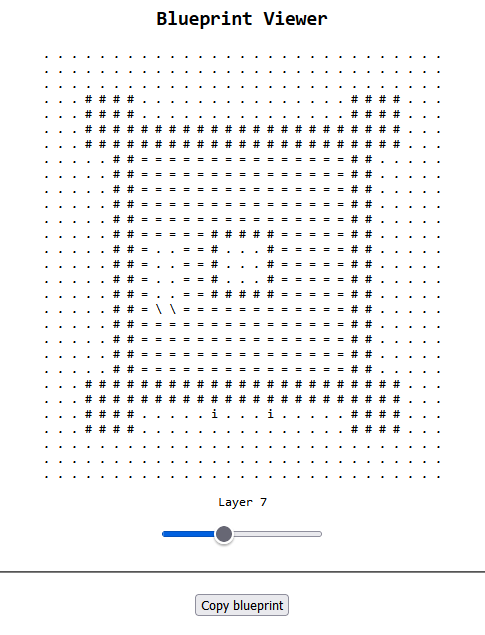

# JavaScript assignment -- Minecraft

Building castles in Minecraft with JavaScript.

## Features

Project is divided into two parts:
- Minecraft compatible script - ``castle-builder.ts``,
- Tool to preview castle blueprint in a browser - ``blueprint-viewer.html``.

<br>

Minecraft script is capable of creating castles with the following features:

- **moat** surrounding the castle with a **bridge**;
- **3 floors**:
    - ground floor with a **gate**;
    - 1st floor with **stairs**;
    - 2nd floor on the roof.
- **4 towers** at the corners;
- **23** glassed **windows** on the outer walls;
- **8 different blocks** in use;
- skylight in the middle.

It launches the building process via the following commands:
- ```build-castle-quick``` is *fast* and uses cached blueprint;
- ```build-castle-slow``` is *very slow* and generates everything in runtime.

<p align="center">
  
</p>

<br>

*Blueprint Viewer* tool is capable of the following:
- showing a single layer view in a web-browser;
- changing layers with a slider;
- saving blueprint into clipboard with a click of a button.

<p align="center">
  
</p>

## Prerequisites

In order to run builder script *Minecraft: Education Edition* version *1.17+* is required. 

<br>

Using *Blueprint Viewer* requires *TypeScript* package installed:

```cmd
npm install -g typescript
```

## Run

To run *castle-builder* script simply copy the body of ``castle-builder.ts`` script into the Minecraft's Code Builder editor field. Press *t* to type in the chat and execute ``build-castle-quick`` command.

<br>

To run *Blueprint Viewer* tool you have to simply open the ``blueprint-viewer.html`` file in a web-browser.

In order to edit some code you have to open the project in a code editor e.g. *Visual Studio Code* and run build task ``Ctrl+Shift+B`` to watch for changes. The TypeScript file will be built into JavaScript on every change. 

It is also recommended to launch something like *live server* to see live changes in a browser.
